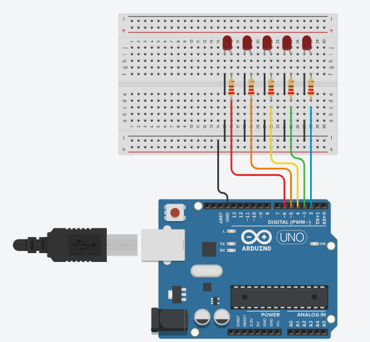

## 1.5.4 Pertanyaan Praktikum
  1. Pada kondisi apa program masuk ke blok if? 
  2. Pada kondisi apa program masuk ke blok else? 
  3. Apa fungsi dari perintah delay(timeDelay)? 
  4. Jika program yang dibuat memiliki alur mati → lambat → cepat → reset (mati), 
     ubah menjadi LED tidak langsung reset → tetapi berubah dari cepat → sedang → 
     mati dan berikan penjelasan disetiap baris kode nya

## Jawaban:
1. Program akan masuk ke blok if ketika variabel timeDelay bernilai kurang dari atau sama dengan 100.
2. Program akan masuk ke blok else selama nilai timeDelay masih lebih besar dari 100.
3. Perintah ini berfungsi untuk menghentikan sementara eksekusi program (menahan status LED) selama durasi tertentu dalam milidetik (ms).
4. LED tidak langsung reset → tetapi berubah dari cepat → sedang → mati
```cpp
const int ledPin = 6;      
int timeDelay = 1000;      
bool isSpeedingUp = true;  

void setup() {
    pinMode(ledPin, OUTPUT); 
}

void loop() {

    digitalWrite(ledPin, HIGH); 
    delay(timeDelay);           
    digitalWrite(ledPin, LOW);  
    delay(timeDelay);           

    if (isSpeedingUp) {
        timeDelay -= 100;         
    
    if (timeDelay <= 100) {
      isSpeedingUp = false;  
        }
    } 
    else {
        timeDelay += 200;         
        if (timeDelay >= 1000) {
            delay(2000);            
            isSpeedingUp = true;    
        }
    }
}
```

1.6.4 Pertanyaan Praktikum
  1. Gambarkan rangkaian schematic 5 LED running yang digunakan pada percobaan!
  2. Jelaskan bagaimana program membuat efek LED berjalan dari kiri ke kanan!
  3. Jelaskan bagaimana program membuat LED kembali dari kanan ke kiri!
  4. Buatkan program agar LED menyala tiga LED kanan dan tiga LED kiri secara bergantian dan berikan penjelasan disetiap baris kode nya dalam bentuk README.md!

Jawaban:
1. skema rangkaian 5 pin.


2. Efek LED yang terlihat berjalan dari kiri ke kanan dibuat dengan menggunakan perulangan **for** yang melakukan penambahan nilai secara bertahap. Dari pin 2 hingga pin 7 dan di dalam loop led yang ada di pin tersebut dinyalakan (HIGH) selama durasi timer, dimatikan lalu lanjut kepin setelahnya. nahyang membuat terlihatdari kiri ke kanan karena perulangan dimulai dari pin 2 yag berada di kiri arduino ke bagian kanan 
3. hal ini terjadi di loop berikutnya dimana pin dimulai dari 7 ke 2 dan melakukan decreement for (int ledPin = 7; ledPin >= 2; ledPin--) ini membuat perulangan terbalik dan led akan berjalan dari kanan arduino ke bagian kiri
4. Program LED menyala tiga LED kanan dan tiga LED kiri secara bergantian
```cpp
void setup() {
  // Inisialisasi pin 
  for (int i = 2; i <= 7; i++) {
    pinMode(i, OUTPUT);
  }
}

void loop() {
  // kiri hidup kanan mati
  for (int i = 2; i <= 4; i++) digitalWrite(i, HIGH); 
  for (int i = 5; i <= 7; i++) digitalWrite(i, LOW);  
  delay(500); 

  // gatian kiri mati kanan hidup
  for (int i = 2; i <= 4; i++) digitalWrite(i, LOW);  
  for (int i = 5; i <= 7; i++) digitalWrite(i, HIGH); 
  delay(500); 
}