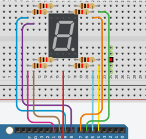
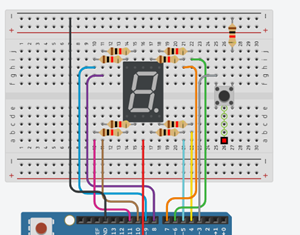

## 2.5.4 Pertanyaan Praktikum
1. Gambarkan rangkaian schematic yang digunakan pada percobaan!
2. Apa yang terjadi jika nilai num lebih dari 15?
3. Apakah program ini menggunakan common cathode atau common anode? Jelaskan
alasanya!
4. Modifikasi program agar tampilan berjalan dari F ke 0 dan berikan penjelasan disetiap
baris kode nya dalam bentuk README.md!

## jawaban
1. schematic rangkaian



2. jika melebihi 15 maka akan terjadi array out of bound dimana memori membaca keluar batas. karena hanya di deklarasi sebanyak 16 dari 0-15 jika melebihi 15 maka setelah 15 program akan membaca secara acak akibatya mikrokontroller akan mengirim data biner acak yang membuat lcd menyala denga polayang tidak teratur. 
3. anode karena vcc berada di tengah
4. modifikasi program
```cpp
#include <Arduino.h>

const int segmentPins[8] = {7, 6, 5, 11, 10, 8, 9, 4};

const int buttonPin = 2;

int counter = 15;

bool lastButtonState = HIGH;

byte digitPattern[16][8] = {
  {1,1,1,1,1,1,0,0}, 
  {0,1,1,0,0,0,0,0}, 
  {1,1,0,1,1,0,1,0}, 
  {1,1,1,1,0,0,1,0}, 
  {0,1,1,0,0,1,1,0}, 
  {1,0,1,1,0,1,1,0}, 
  {1,0,1,1,1,1,1,0}, 
  {1,1,1,0,0,0,0,0}, 
  {1,1,1,1,1,1,1,0}, 
  {1,1,1,1,0,1,1,0}, 
  {1,1,1,0,1,1,1,0}, 
  {0,0,1,1,1,1,1,0}, 
  {1,0,0,1,1,1,0,0}, 
  {0,1,1,1,1,0,1,0}, 
  {1,0,0,1,1,1,1,0}, 
  {1,0,0,0,1,1,1,0}  
};

// Fungsi Tampilkan digit
void displayDigit(int num) {
  for(int i=0; i<8; i++) {
    digitalWrite(segmentPins[i], !digitPattern[num][i]);
  }
}

void setup() {
  for(int i=0; i<8; i++) {
    pinMode(segmentPins[i], OUTPUT);
  }

  pinMode(buttonPin, INPUT_PULLUP);
  displayDigit(counter); 
}

void loop() {
  bool currentButtonState = digitalRead(buttonPin);

  // deteksi tekan (HIGH -> LOW)
  if (lastButtonState == HIGH && currentButtonState == LOW) {
    counter--; 
    
    // Modifikasi: Jika nilai di bawah 0, kembalikan ke 15 (F)
    if(counter < 0) counter = 15; 

    displayDigit(counter); 
    delay(200); 
  }

  lastButtonState = currentButtonState;
}
```
penjelasan:
perulangan dibalik dari 15 ke nol, dengan decreement c-- maka program akan berjalan secara terbalik.

## 2.6.4 Pertanyaan Praktikum
1. Gambarkan rangkaian schematic yang digunakan pada percobaan!
2. Mengapa pada push button digunakan mode INPUT_PULLUP pada Arduino Uno?
Apa keuntungannya dibandingkan rangkaian biasa?
3. Jika salah satu LED segmen tidak menyala, apa saja kemungkinan penyebabnya dari
sisi hardware maupun software?
4. Modifikasi rangkaian dan program dengan dua push button yang berfungsi sebagai
penambahan (increment) dan pengurangan (decrement) pada sistem counter dan
berikan penjelasan disetiap baris kode nya dalam bentuk README.md!

## jawaban
1. rangkaian schematic



2. input_pullup secara softeware bisa mengaktifkan resistorinternal yang ada di dalam mikro kontroller ynag terhubung ke vcc
keuntungan:
-  mencegah floating 
-  efisiensi perangkat keras

3. jika led segmen tidak menyala
secara hardware
- kabel longgar
- komponen rusak
- salah wiring
secara software
- salah pin mapping
- kesalahan logika pada pola biner

4. modifikasi 
```cpp
 #include <Arduino.h>

// Pin 7-Segment (a b c d e f g dp)
const int segmentPins[8] = {7, 6, 5, 11, 10, 8, 9, 4};

// Push button
const int buttonPin2 = 2;
const int buttonPin3 = 3;

// Counter
int counter = 0;

// State button
bool lastButtonState2 = HIGH;
bool lastButtonState3 = HIGH;

// Pola digit 0-F
byte digitPattern[16][8] = {
  {1,1,1,1,1,1,0,0}, //0
  {0,1,1,0,0,0,0,0}, //1
  {1,1,0,1,1,0,1,0}, //2
  {1,1,1,1,0,0,1,0}, //3
  {0,1,1,0,0,1,1,0}, //4
  {1,0,1,1,0,1,1,0}, //5 
  {1,0,1,1,1,1,1,0}, //6
  {1,1,1,0,0,0,0,0}, //7
  {1,1,1,1,1,1,1,0}, //8
  {1,1,1,1,0,1,1,0}, //9
  {1,1,1,0,1,1,1,0}, //A
  {0,0,1,1,1,1,1,0}, //b
  {1,0,0,1,1,1,0,0}, //C
  {0,1,1,1,1,0,1,0}, //d
  {1,0,0,1,1,1,1,0}, //E
  {1,0,0,0,1,1,1,0}  //F
};

// Tampilkan digit
void displayDigit(int num)
{
  for(int i=0; i<8; i++)
  {
    digitalWrite(segmentPins[i], !digitPattern[num][i]);
  }
}

void setup()
{
  for(int i=0; i<8; i++)
  {
    pinMode(segmentPins[i], OUTPUT);
  }

  pinMode(buttonPin2, INPUT_PULLUP);
  pinMode(buttonPin3, INPUT_PULLUP);

  displayDigit(counter); // tampilkan awal
}

void loop()
{
  bool currentButtonState2 = digitalRead(buttonPin2);
  bool currentButtonState3= digitalRead(buttonPin3);

  // deteksi tekan (HIGH -> LOW)
  if (lastButtonState2 == HIGH && currentButtonState2 == LOW)
  {
    counter++;
    if(counter > 15) counter = 0;

    displayDigit(counter); // update hanya saat ditekan

    delay(200); // debounce sederhana
  }
  if (lastButtonState3 == HIGH && currentButtonState3 == LOW)
  {
    counter--;
    if(counter > 15) counter = 0;

    displayDigit(counter); // update hanya saat ditekan

    delay(200); // debounce sederhana
  }

  lastButtonState2 = currentButtonState2;
  lastButtonState3 = currentButtonState3;
}
```
penjelasan:
- ditambah pin untuk satu tombol lagi 
- penambahan perulangan untuk decrement dan untuk tombol satunya jadi datu untuk mengurangi dan satu untuk menambah
