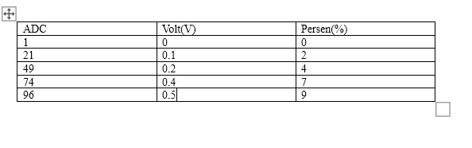

# 3.5.4 Pertanyaan Praktikum
1) Jelaskan proses dari input keyboard hingga LED menyala/mati!
2) Mengapa digunakan Serial.available() sebelum membaca data? Apa yang terjadi jika baris tersebut dihilangkan?
3) Modifikasi program agar LED berkedip (blink) ketika menerima input '2' dengan kondisi jika ‘2’ aktif maka LED akan terus berkedip sampai perintah selanjutnya diberikan dan berikan penjelasan disetiap baris kode nya dalam bentuk README.md!
4) Tentukan apakah menggunakan delay() atau milis()! Jelaskan pengaruhnya terhadap sistem

## jawaban:
1) penjelasan
- serial monitor akan memunculkan tulisan "Ketik '1' untuk menyalakan LED, '0' untuk mematikan LED" setelah itu kita diminta memasukkan angka 1 dari keyboard untuk menyalakan led dan 0 untuk mematikan led
- setelah kita memasukkan input, kuambil contoh 1, maka data akan dikirim ke arduino melalui kabel uart yang terpasang
- program akan mengecek data yang masuk dengan 
```cpp 
if (Serial.available() > 0)
```
yang kemudian akan dibaca nilai inputnya menggunakan serial.read dan data akan masuk ke pecabangan 
```cpp
if (data == '1') {
      digitalWrite(PIN_LED, HIGH);
      Serial.println("LED ON");
    }
```
jika yang masuk angka satu maka led akan di set ke high atau hidup. jika yang masuk adalah angka nol
```cpp
else if (data == '0') {
      digitalWrite(PIN_LED, LOW);
      Serial.println("LED OFF");
}
```
maka led akan di set ke low atau dimatikan

2) fungsi Serial.available() adlah untuk memastikan data benar benar masuk ke dalam serial buffer sebelum menjalankan read(). jika fungsi Serial.available() dihilangkan maka Fungsi Serial.read() akan terus berjalan di setiap perulangan loop(). Jika tidak ada data yang masuk, ia akan mengembalikan nilai -1, yang dapat menyebabkan logika program error atau mengeksekusi perintah yang tidak diinginkan secara terus-menerus
3) modifikasi program
```cpp
#include <Arduino.h>

const int PIN_LED = 12;
char mode = '0'; 

void setup() {
  Serial.begin(9600);
  Serial.println("Ketik '1' untuk menyalakan LED, '0' untuk mematikan LED, '2' untuk LED blink");
  pinMode(PIN_LED, OUTPUT);
}

void loop() {
  
  if (Serial.available() > 0) {
    char inputBaru = Serial.read();

    
    if (inputBaru != '\n' && inputBaru != '\r') {
      mode = inputBaru; 
      
      if (mode == '1') {
        digitalWrite(PIN_LED, HIGH);
        Serial.println("Mode: LED ON");
      } 
      else if (mode == '0') {
        digitalWrite(PIN_LED, LOW);
        Serial.println("Mode: LED OFF");
      } 
      else if (mode == '2') { // penambahan percabagan untuk input 2  
        Serial.println("Mode: LED BLINKING");// jika mendapat 2 maka led akan ngeblink
      } 
      else {
        Serial.println("Perintah tidak dikenal");
      }
    }
  }

  if (mode == '2') {//delay untuk blinking dari input 2 
    digitalWrite(PIN_LED, HIGH);
    delay(100);
    digitalWrite(PIN_LED, LOW);
    delay(500);
  }
}
```
4) menggunakan delay() pengaruhnya delay() bersifat blocking yang membuat sistem kurang responsif contoh ketika delay(600) dan disaay delay itu kita memasukkan angka 0 maka sistem akan menjalankan setelah durasi delay selesai

# 3.6.4 Pertanyaan Praktikum
1) Jelaskan bagaimana cara kerja komunikasi I2C antara Arduino dan LCD pada rangkaian
tersebut!
2) Apakah pin potensiometer harus seperti itu? Jelaskan yang terjadi apabila pin kiri dan
pin kanan tertukar!
3) Modifikasi program dengan menggabungkan antara UART dan I2C (keduanya sebagai
output) sehingga:
- Data tidak hanya ditampilkan di LCD tetapi juga di Serial Monitor
- Adapun data yang ditampilkan pada Serial Monitor sesuai dengan table berikut:
ADC: 0 Volt: 0.00 V Persen: 0%
Tampilan jika potensiometer dalam kondisi diputar paling kiri
- ADC: 0 0% | setCursor(0, 0) dan Bar (level) | setCursor(0, 1)
- Berikan penjelasan disetiap baris kode nya dalam bentuk README.md!
4) Lengkapi table berikut berdasarkan pengamatan pada Serial Monitor

## jawaban
1) arduino dan lcd memiliki hubungan master-slave, arduino akan megirikan data melalui alamat lcd x27, disini komunikasi hanya menggunakan 2 kabel sda untuk data dan scl untuk sinkronisasi clock
2) tidak harus, jika terbalik maka nilai adc akan terbalik
3) modifikasi program
```cpp
#include <Wire.h>
#include <LiquidCrystal_I2C.h>
#include <Arduino.h>

// Inisialisasi LCD I2C (Alamat 0x27, 16 kolom, 2 baris)
LiquidCrystal_I2C lcd(0x27, 16, 2);

const int pinPot = A0; 

void setup() {
  Serial.begin(9600);
  lcd.init();
  lcd.backlight();
}

void loop() {
  int nilaiADC = analogRead(pinPot);

  // Kalkulasi Volt (0.00 - 5.00V) dan Persentase
  float volt = (nilaiADC / 1023.0) * 5.0;
  int persen = map(nilaiADC, 0, 1023, 0, 100);

  // 1. Output ke Serial Monitor (Sesuai format tabel yang diminta)
  Serial.print("ADC: ");
  Serial.print(nilaiADC);
  Serial.print(" Volt: ");
  Serial.print(volt);
  Serial.print(" V Persen: ");
  Serial.print(persen);
  Serial.println("%");

  // 2. Output ke LCD (I2C)
  // Baris 1: ADC, Volt, dan Persen
  lcd.setCursor(0, 0);
  lcd.print(nilaiADC);
  lcd.print(" ");
  lcd.print(volt, 1); // Menampilkan 1 angka di belakang koma (misal 5.0)
  lcd.print("V ");
  lcd.print(persen);
  lcd.print("%   "); // Spasi untuk clear sisa karakter

  // Baris 2: Progress Bar (Level)
  lcd.setCursor(0, 1);
  int panjangBar = map(nilaiADC, 0, 1023, 0, 16);
  for (int i = 0; i < 16; i++) {
    if (i < panjangBar) {
      lcd.print((char)255); 
    } else {
      lcd.print(" "); 
    }
  }

  delay(200); 
}
```
4) tabel
