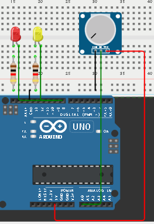
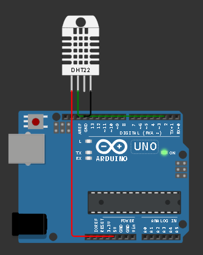

# pertanyaan 5.5.4
1. Apakah ketiga task berjalan secara bersamaan atau bergantian? Jelaskan mekanismenya!
2. Bagaimana cara menambahkan task keempat? Jelaskan langkahnya!
3. Modifikasilah program dengan menambah sensor (misalnya potensiometer), lalu
gunakan nilainya untuk mengontrol kecepatan LED! Bagaimana hasilnya? Jelaskan
program
## jawaban
1. bergantian, pada dasarnya arduino hanya bisa mengeksekusi satu instruksi pada satu waktu. namun dengan rtos instruksi akan dijalankan bergantian dengan cepat sehingga terlihat seperti sedang menjalankan 2 instruksi bersama.
2. tambahkan void task baru dan xtaskcreate baru, kemudian tambahkan fungsi baru
3. modifikasi





```cpp
#include <Arduino_FreeRTOS.h>

void TaskBlink1( void *pvParameters );
void TaskBlink2( void *pvParameters );
void Taskprint( void *pvParameters );

void setup() {
  Serial.begin(9600);
  
  xTaskCreate(TaskBlink1, "task1", 128, NULL, 1, NULL);
  xTaskCreate(TaskBlink2, "task2", 128, NULL, 1, NULL);
  xTaskCreate(Taskprint, "task3", 128, NULL, 1, NULL);
  
  vTaskStartScheduler();
}

void loop() {
}

void TaskBlink1(void *pvParameters) {
  pinMode(8, OUTPUT);
  
  while(1) {
    int potValue = analogRead(A0); 
    
    int delayTime = potValue + 50; 
    
    Serial.print("Task1 - Delay LED Merah: ");
    Serial.println(delayTime);
    
    digitalWrite(8, HIGH);
    vTaskDelay( delayTime / portTICK_PERIOD_MS );
    digitalWrite(8, LOW);
    vTaskDelay( delayTime / portTICK_PERIOD_MS );
  }
}

void TaskBlink2(void *pvParameters) {
  pinMode(7, OUTPUT); 
  
  while(1) {
    Serial.println("Task2"); 
    digitalWrite(7, HIGH); 
    vTaskDelay( 300 / portTICK_PERIOD_MS );
    digitalWrite(7, LOW);
    vTaskDelay( 300 / portTICK_PERIOD_MS );
  }
}

void Taskprint(void *pvParameters) {
  int counter = 0;
  
  while(1) {
    counter++;
    Serial.print("Task3 - Counter: ");
    Serial.println(counter); 
    vTaskDelay( 500 / portTICK_PERIOD_MS ); 
  }
}
```

# pertanyaan 5.6.4
1. Apakah kedua task berjalan secara bersamaan atau bergantian? Jelaskan mekanismenya!
2. Apakah program ini berpotensi mengalami race condition? Jelaskan!
3. Modifikasilah program dengan menggunakan sensor DHT sesungguhnya sehingga
informasi yang ditampilkan dinamis. Bagaimana hasilnya? Jelaskan program
## jawaban
1. bergantian sama seperti percobaanpertama namun lebih teratur karena menggunakan queue
2. Tidak. karena penggunaan Queue bawaan FreeRTOS sudah dirancang secara bawaan untuk thread-safe.
3. modifikasi





```cpp
#include <Arduino_FreeRTOS.h>
#include <queue.h>
#include <DHT22.h>

#define DHT22_PIN 2

// Membuat objek DHT22
DHT22 dht22(DHT22_PIN);

struct readings {
  float temp;
  float hum;
};

QueueHandle_t my_queue;

void read_data(void *pvParameters);
void display_data(void *pvParameters);

void setup() {

  Serial.begin(9600);

  // Membuat queue
  my_queue = xQueueCreate(5, sizeof(struct readings));

  // Membuat task membaca sensor
  xTaskCreate(
    read_data,
    "Read Sensor",
    128,
    NULL,
    1,
    NULL
  );

  // Membuat task menampilkan data
  xTaskCreate(
    display_data,
    "Display",
    128,
    NULL,
    1,
    NULL
  );

  // Menjalankan scheduler
  vTaskStartScheduler();
}

void loop() {
  // kosong karena menggunakan FreeRTOS
}

// ==================== TASK MEMBACA SENSOR ====================
void read_data(void *pvParameters) {

  struct readings data;

  while (1) {

    // Membaca data dari DHT22
    float temperature = dht22.getTemperature();
    float humidity = dht22.getHumidity();

    // Mengecek apakah data valid
    if (dht22.getLastError() != dht22.OK) {

      Serial.print("DHT22 error: ");
      Serial.println(dht22.getLastError());

    } else {

      data.temp = temperature;
      data.hum = humidity;

      // Mengirim data ke queue
      xQueueSend(my_queue, &data, portMAX_DELAY);
    }

    // Delay 2 detik
    vTaskDelay(2000 / portTICK_PERIOD_MS);
  }
}

// ==================== TASK MENAMPILKAN DATA ====================
void display_data(void *pvParameters) {

  struct readings data;

  while (1) {

    // Menerima data dari queue
    if (xQueueReceive(my_queue, &data, portMAX_DELAY) == pdPASS) {

      Serial.print("Temperature = ");
      Serial.print(data.temp);
      Serial.println(" C");

      Serial.print("Humidity = ");
      Serial.print(data.hum);
      Serial.println(" %");

      Serial.println("-------------------");
    }
  }
}
```


